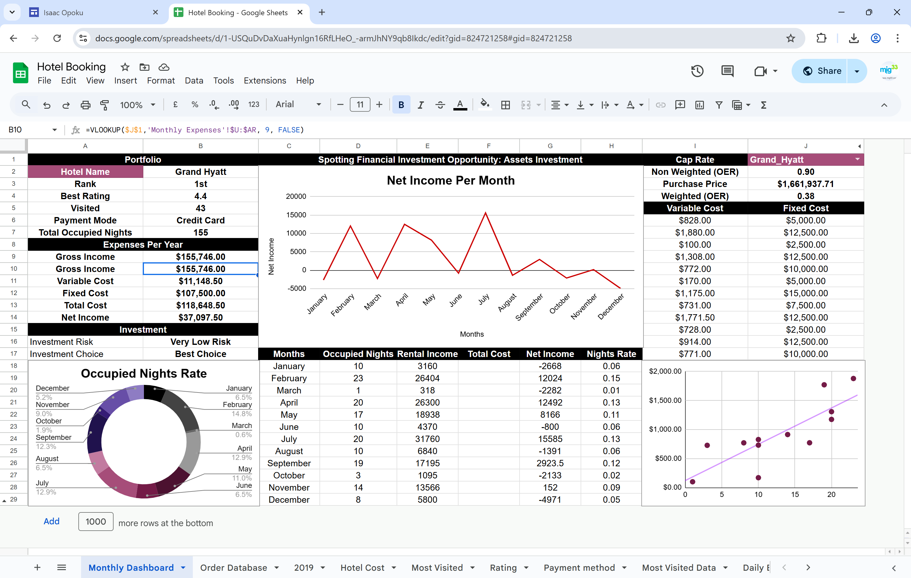

# hotel-booking-dashboard

A Google Sheets-based to spot investment opportunity using financial and performance dashboard for hotel bookings

\# Hotel Booking Dashboard (Google Sheets)

This project is a comprehensive Google Sheets-based dashboard designed to analyze hotel performance through financial metrics like occupancy, rental income, and net income. It helps identify investment opportunities using real data.

---

\## Features

\- Monthly Net Income tracking

\- Occupied Nights Rate (Donut Chart)

\- Net Income Trend (Line Chart)

\- Cap Rate, OER, and Fixed/Variable Cost Analysis

\- Pivot Tables for Monthly and Yearly Aggregates

\- Dynamic Dropdowns for hotel selection (via Data Validation)

\- Conditional Formatting for income insights

---

\## Screenshot

!\[Dashboard Screenshot](screenshots/dashboard.png)

---

\## Key Formulas Used

\### Cleaning

\- `=TEXT(B4, "MMMM")` – Convert date to month name

\- `=TRIM()`, `=CLEAN()` – Text cleanup

\- `=IFERROR()` – Handle formula errors gracefully

\- `=SUBSTITUTE()`, `=VALUE()` – Text to number conversion

\### Modelling

\- `=VLOOKUP(...)`, `=INDEX(MATCH(...))` – Lookup and match across sheets

\- `=SUMIFS(...)`, `=COUNTIFS(...)` – Conditional aggregation

\- `=H8/E8` – Cap Rate formula

\- `=ROUND()`, `=IF()` – Rounded and conditional logic

\- `=SORT()`, `=UNIQUE()`, `=FILTER()` – Sorting, deduplication, and filtering

\### Dashboard Integration

\- Conditional formatting rules for performance indicators

\- Pivot tables for summarized metrics

\- Data validation lists (dropdowns)

\- Named ranges for cleaner formula writing

\- Visualizations: Line Chart, Donut Chart, Scatter Plot with trendline

---

\## Folder Structure

Hotel-Booking-Dashboard/

├── README.md

├── formulas.md

├── screenshots/

│ └── dashboard.png

├── data/

│ └── sample-dataset.csv

---

\## How to Use

1\. Open the Google Sheet template or duplicate it into your Drive.

2\. Update the data in `Daily Expenses`, `Most Visited`, or `2019` tabs.

3\. Use the dropdown to select a hotel and review its performance.

4\. Analyze metrics using the charts, pivot summaries, and income trends.

---

\## Tools Used

\- Google Sheets

\- Pivot Tables

\- Charts (Line, Donut, Scatter)

\- Data Validation \& Named Ranges

\- Conditional Formatting

---

\## Author

Built by \*\*Isaac Opoku\*\*  

Email \ikeopoku@outlook.com

Portfolio: https://sites.google.com/view/isaac-opoku

Linkedin: https://www.linkedin.com/in/isaac-opoku-analytics-economics-specialist/

Medium: https://medium.com/@ikeopoku

---

\## License

This project is open-source and is available.

[View Google Sheet Dashboard](https://docs.google.com/spreadsheets/d/1-USQuDvDaXuaHynlgn16RfLHeO_-armJhNY9qb8Ikdc/edit?usp=sharing)

